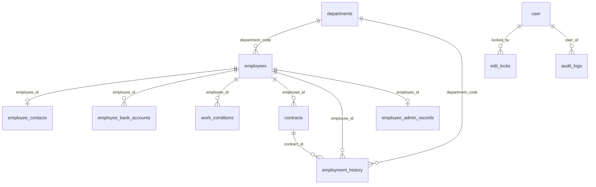

# データベーススキーマ（従業員データベース）

本ドキュメントは、本リポジトリで管理している **Supabase（PostgreSQL）** 上の業務スキーマと、認証まわりのテーブル関係をまとめたものです。

## 情報の出所（SoT）

| 種別 | パス・備考 |
|------|------------|
| ベース DDL | `database/supabase_schema.sql`（テーブル定義の中心） |
| 差分・追補 | `database/migrations/*.sql`（列追加・制約・Better-Auth 統合など） |
| アプリ側のロール型 | `apps/nextjs/src/lib/auth.ts` の `UserRole` |

> **注意**: 本リポジトリのスナップショットには Prisma の `schema.prisma` が含まれていない場合があります。実 DB の列名・型は **Supabase / `information_schema`** で確認してください。特に `public.user` の所属部門列は、歴史的経緯で `department_code`（スネーク）と `departmentCode`（camelCase）のどちらかが存在しうるため、適用済みマイグレーションと Better-Auth の `additionalFields` を照合してください。

---

## 全体像（ER 概要）

---

## 業務テーブル一覧

### 1. `departments`（部門マスター）

| 列 | 型 | 制約・説明 |
|----|-----|------------|
| `code` | TEXT | PK（例: `BPS課`） |
| `name` | TEXT | NOT NULL |
| `is_active` | BOOLEAN | DEFAULT true |
| `created_at` / `updated_at` | TIMESTAMPTZ | DEFAULT NOW() |
| `updated_by` | TEXT | NOT NULL、初期値 `system` |

---

### 2. `employees`（従業員マスター）

| 列 | 型 | 制約・説明 |
|----|-----|------------|
| `id` | TEXT | PK |
| `employee_number` | TEXT | UNIQUE NOT NULL |
| `branch_number` | INTEGER | NOT NULL、DEFAULT 0 |
| `name` / `name_kana` | TEXT | NOT NULL |
| `sticker_item` | TEXT | フセン項目（入社時登録必須系の仕様で使用） |
| `gender` | TEXT | `MALE` \| `FEMALE` \| `OTHER` |
| `birth_date` / `hired_at` | DATE | NOT NULL |
| `rehired_at` / `retired_at` | DATE | 再入社日・退職日 |
| `nationality` | TEXT | 任意 |
| `employment_type` | TEXT | `FULL_TIME` \| `PART_TIME` \| `CONTRACT` |
| `employment_status` | TEXT | `ACTIVE` \| `RETIRED` \| `ON_LEAVE` \| `STANDBY` \| `ARCHIVED`（FR-130 拡張） |
| `department_code` | TEXT | NOT NULL、FK → `departments(code)`。マイグレーションにより **4 部門のみ** の CHECK あり（`BPS課` / `オンサイト課` / `CC課` / `PS課`） |
| `site_code` | TEXT | 所属コード（拠点略称、例: `ITS`）FR-001 |
| `my_number` | TEXT | 個人番号（取り扱いは権限・ポリシー厳守） |
| `rehire_count` | INTEGER | DEFAULT 0、再雇用回数（FR-131） |
| `original_hire_date` | DATE | 初回入社日（FR-131） |
| `current_hire_date` | DATE | 現在雇用開始日（FR-131） |
| `created_at` / `updated_at` | TIMESTAMPTZ | |
| `updated_by` | TEXT | NOT NULL |

**インデックス（代表）**: `employee_number`、`department_code`+`employment_status`、`employment_status`

---

### 3. `employee_contacts`（住所・連絡先）

| 列 | 型 | 説明 |
|----|-----|------|
| `id` | TEXT | PK |
| `employee_id` | TEXT | UNIQUE NOT NULL、FK → `employees(id)` ON DELETE CASCADE |
| `postal_code`, `address1`, `address2`, `address1_kana`, `address2_kana` | TEXT | 現住所 |
| `phone1`, `email1` | TEXT | |
| `resident_address_same` | BOOLEAN | DEFAULT true、住民票住所が現住所と同じか |
| `resident_postal_code` | TEXT | 住民票郵便番号（`resident_address_same = false` 時） |
| `resident_address1`, `resident_address2` | TEXT | 住民票住所 |
| `resident_address1_kana`, `resident_address2_kana` | TEXT | 住民票住所カナ |
| `created_at` / `updated_at` / `updated_by` | | 監査用 |

> spec 008 のマイグレーションコメントでは「個人情報最小化により住所・電話・口座を保存しない」方針も言及されています。運用ポリシーと実装の両方を確認してください。

---

### 4. `employee_bank_accounts`（振込口座・支払）

| 列 | 型 | 説明 |
|----|-----|------|
| `id` | TEXT | PK |
| `employee_id` | TEXT | FK → `employees` CASCADE |
| `payment_priority` | INTEGER | DEFAULT 1、`(employee_id, payment_priority)` UNIQUE |
| `handling_category`, `payment_category` | TEXT | |
| `bank_code`, `bank_name`, `branch_code`, `branch_name` | TEXT | |
| `deposit_type` | TEXT | NULL または `SAVINGS` \| `CHECKING` \| `OTHER` |
| `account_number`, `account_holder_name` | TEXT | |
| `is_active` | BOOLEAN | DEFAULT true |
| 監査列 | | `created_at` / `updated_at` / `updated_by` |

---

### 5. `work_conditions`（勤務条件）

| 列 | 型 | 説明 |
|----|-----|------|
| `id` | TEXT | PK |
| `employee_id` | TEXT | FK → `employees` CASCADE |
| `effective_from` / `effective_to` | DATE | 適用期間 |
| `work_days_type` | TEXT | `WEEKLY` \| `MONTHLY` \| `SHIFT` |
| `work_days_count` | INTEGER | NOT NULL |
| `work_days_count_note` | TEXT | |
| `holidays_jsonb` | JSONB | DEFAULT `[]`、休日情報 |
| `holidays_note` | TEXT | |
| `paid_leave_base_date` | DATE | |
| `working_hours_jsonb` | JSONB | 勤務時間帯（複数） |
| `break_hours_jsonb` | JSONB | 休憩時間帯 |
| `work_locations_jsonb` | JSONB | 勤務場所 |
| `transportation_routes_jsonb` | JSONB | 交通費ルート等 |
| 監査列 | | |

**インデックス**: `employee_id`+`effective_from` DESC、各 JSONB に GIN（定義は `supabase_schema.sql` 参照）

#### アプリで拡張した JSONB 要素（画面との対応）

| JSONB | 配列要素の主なキー（保存時はスネークケース） | 画面での表示 |
|-------|---------------------------------------------|--------------|
| `transportation_routes_jsonb` | `route`（経路１）, `usage_period`（利用期間）, `transportation_name`（交通機関名）, `round_trip_amount`（金額・往復１）, `monthly_pass_amount`（金額・１か月定期１）, 既存の `max_amount`, `nearest_station` | **基本情報**: 従業員登録・従業員管理の「通勤費」／**契約フロー**: 勤務条件の「通勤費」 |
| `work_locations_jsonb` | `company_name`, `office_name`, `address`, `phone_number`, 後方互換用 `location` | **契約内容**: 就業の場所（会社名・事業所名・住所・電話番号） |
| `working_hours_jsonb` | `start_time`, `end_time`（アプリ上は始業時間・就業時間） | **契約内容**: 勤務時間 |
| `break_hours_jsonb` | `start_time`, `end_time` | **契約内容**: 休憩時間 |

| テーブル | 列 | 画面 |
|----------|-----|------|
| `contracts` | `job_description` | **契約内容**: 業務の内容 |
| `contracts` | `hourly_wage` | **契約内容**: 賃金（時給制）の「時間給」 |

---

### 6. `contracts`（雇用契約）

| 列 | 型 | 説明 |
|----|-----|------|
| `id` | TEXT | PK |
| `employee_id` | TEXT | FK → `employees` CASCADE |
| `contract_type` | TEXT | `INDEFINITE` \| `FIXED_TERM` \| `REHIRED` \| `DISABILITY` |
| `wage_type` | TEXT | DEFAULT `HOURLY` — `HOURLY` \| `PIECEWORK` |
| `contract_start_date` | DATE | NOT NULL |
| `contract_end_date` | DATE | 後方互換用に保持 |
| `employment_expiry_scheduled_date` | DATE | 雇用満了**予定**（アラート等） |
| `employment_expiry_date` | DATE | 実際の雇用満了日 |
| `is_renewable` | BOOLEAN | |
| `fixed_term_base_date` | DATE | |
| `job_description` | TEXT | |
| `hourly_wage` | DECIMAL(10,2) | NOT NULL |
| `sub_leader_allowance_amount` | DECIMAL(10,2) | サブリーダー手当 |
| `perfect_attendance_allowance_eligible` | BOOLEAN | 精勤手当対象 |
| `hourly_wage_note` | TEXT | |
| `overtime_hourly_wage` | DECIMAL(10,2) | 残業時給（spec 追補） |
| `paid_leave_clause` | TEXT | |
| `termination_alert_flag` | BOOLEAN | 満了アラート対象 |
| `job_description_change_scope` | TEXT | DEFAULT '会社の定める業務'、業務変更の範囲 |
| `work_location_change_scope` | TEXT | DEFAULT '会社の定める事業所'、就業場所変更の範囲 |
| `overtime_work` | BOOLEAN | DEFAULT true、所定外労働の有無 |
| `holiday_work` | BOOLEAN | DEFAULT true、休日労働の有無 |
| `paid_leave_days` | INTEGER | 年次有給休暇日数 |
| `paid_leave_base_date_type` | TEXT | 基準日タイプ（`SIX_MONTHS_AFTER_HIRE` \| `OTHER`） |
| `paid_leave_base_date` | DATE | 有休基準日 |
| `disability_leave_frequency` | TEXT | 障がい者通院休暇（例: `月2回`） |
| `commuting_allowance_max` | DECIMAL(10,2) | DEFAULT 15000、通勤手当月限度額 |
| `retirement_age` | INTEGER | 定年年齢（60 \| 65、無期のみ） |
| `retirement_date` | DATE | 定年日（自動計算） |
| `client_holiday_follow` | BOOLEAN | DEFAULT false、客先休日に合わせる |
| `holidays_note` | TEXT | 休日補足 |
| `working_hours_note` | TEXT | 勤務時間補足 |
| `piecework_shift_pattern` | TEXT | 出来高制勤務パターン |
| `bonus_clause` | TEXT | 賞与条項 |
| `employment_insurance_enrolled` | BOOLEAN | DEFAULT false、雇用保険加入（契約単位） |
| `health_insurance_enrolled` | BOOLEAN | DEFAULT false、健康保険加入（契約単位） |
| `pension_enrolled` | BOOLEAN | DEFAULT false、厚生年金加入（契約単位） |
| `pension_fund_enrolled` | BOOLEAN | DEFAULT false、厚生年金基金加入（契約単位） |
| `eligibility_cert_required` | BOOLEAN | DEFAULT false、資格確認書（紙）要不要 |
| `status` | TEXT | `DRAFT` \| `AWAITING_APPROVAL` \| `SUBMITTED` \| `RETURNED` |
| 監査列 | | |

**制約**: 満了日系は `contract_start_date` との整合 CHECK（`supabase_schema.sql` / 契約満了マイグレーション参照）

---

### 7. `employment_history`（雇用・人事履歴）

| 列 | 型 | 説明 |
|----|-----|------|
| `id` | TEXT | PK |
| `employee_id` | TEXT | FK → `employees` CASCADE |
| `contract_id` | TEXT | FK → `contracts` CASCADE（任意） |
| `effective_date` | DATE | NOT NULL |
| `event_type` | TEXT | 下記 ENUM 参照 |
| `department_code` | TEXT | FK → `departments`、NULL 可。4 部門 CHECK（マイグレーション） |
| `paid_leave_days` | INTEGER | |
| `hourly_wage` | DECIMAL(10,2) | |
| `work_condition_snapshot` | JSONB | DEFAULT `{}` |
| `contract_terms_snapshot` | JSONB | DEFAULT `{}` |
| `documents_snapshot` | JSONB | DEFAULT `{}` |
| `approval_number` | TEXT | 承認番号（FR-094/095 系） |
| `remarks` | TEXT | |
| 監査列 | | |

**`event_type`（CHECK）**: `HIRE`, `TRANSFER`, `PROMOTION`, `SALARY_INCREASE`, `SALARY_DECREASE`, `CONCURRENT_POST`, `RETIRE`, `REINSTATE`, `CONTRACT_UPDATE`

> `grade` 列は仕様に合わせ削除済み（`2025-01-28_update_schema_per_spec.sql`）。

---

### 8. `employee_admin_records`（従業員事務・社保・給与関連）

| 列 | 型 | 説明 |
|----|-----|------|
| `id` | TEXT | PK |
| `employee_id` | TEXT | UNIQUE NOT NULL、FK → `employees` CASCADE |
| `tax_withholding_category` | TEXT | |
| `web_salary_book_enabled` | BOOLEAN | web 給金帳 |
| `employment_insurance` ほか社保系 TEXT | | 各種届出・区分の管理用 |
| `health_insurance_card_type` | TEXT | `MYNUMBER_CARD` \| `PHYSICAL_CARD` \| `ELIGIBILITY_CERT` |
| `health_insurance_category`, `pension_category` | TEXT | spec 008 追補 |
| `basic_pension_number`, `pension_fund_category`, `employment_insurance_number` | TEXT | |
| `base_salary` | DECIMAL(10,2) | |
| `commuting_expense_category`, `commuting_expense_payment_method` | TEXT | |
| `daily_payment_amount` | DECIMAL(10,2) | |
| その他事務フラグ・日付・備考 | TEXT / DATE | `submitted_to_admin_on` 等（詳細は DDL 参照） |
| 監査列 | | |

---

## 認証・セッション（Better-Auth）

Better-Auth が **PostgreSQL**（`DATABASE_URL`）上に作成・利用する標準テーブル（例: **`user`**, **`session`**, **`account`**, **`verification`**）に加え、業務要件で次を拡張します。

| 対象 | 内容 |
|------|------|
| `public.user` | **`role`**: `SYSTEM_ADMIN` / `ADMIN` / `HR_MANAGER` / `FIELD_MANAGER` / `GENERAL_AFFAIRS` / `AUDITOR`（アプリ型は `apps/nextjs/src/lib/auth.ts` と一致） |
| | **`departmentCode`**（text）: 所属部門コード（マイグレーション `2025-12-16_consolidate_user_tables.sql` で `users` から統合） |
| 廃止 | 旧 `public.users` / `public.sessions` は統合マイグレーションで削除（Better-Auth の `user` / `session` を使用） |

列名の実体（`departmentCode` vs `department_code`）は **実 DB** で確認してください。

---

## 運用・非機能テーブル

### `edit_locks`（同時編集ロック）

| 列 | 説明 |
|----|------|
| `resource_id` | PK |
| `resource_type` | `EMPLOYEE` \| `CONTRACT` \| `WORK_CONDITION` |
| `locked_by` | FK → `user(id)` ON DELETE CASCADE |
| `locked_at` / `expires_at` | TIMESTAMPTZ |

### `export_verification`（エクスポート検証・FR-140）

| 列 | 型 | 説明 |
|----|-----|------|
| `verification_id` | TEXT | PK |
| `export_id` | TEXT | NOT NULL、FK → エクスポート履歴 |
| `verified_by` | TEXT | NOT NULL、FK → `user(id)` |
| `verified_at` | TIMESTAMPTZ | DEFAULT NOW() |
| `import_result` | TEXT | `success` \| `partial` \| `failed` |
| `error_details` | TEXT | |
| `error_count` | INTEGER | DEFAULT 0 |
| `success_count` | INTEGER | DEFAULT 0 |
| 監査列 | | `created_at` / `updated_at` / `updated_by` |

### `audit_logs`（監査ログ）

| 列 | 説明 |
|----|------|
| `id` | PK |
| `user_id` | FK → `user(id)` CASCADE |
| `action` | 操作種別 |
| `resource_type` / `resource_id` | 対象リソース |
| `old_values` / `new_values` | JSONB |
| `ip_address` / `user_agent` | 任意 |
| `created_at` | TIMESTAMPTZ |

---

## マイグレーションとベース DDL の関係（参照表）

| マイグレーション例 | 主な内容 |
|--------------------|----------|
| `001_schema_update.sql` | 部門・連絡先・口座テーブル、employees 拡張、work_conditions / contracts / admin 拡張、`user.role` など |
| `2025-01-28_*` | 契約満了日、勤務条件 JSONB 統合、spec 準拠の制約・列、approval_number 等 |
| `2025-11-21_employment_history_snapshots.sql` | 履歴のスナップショット列・`contract_id`・イベント型 CHECK |
| `2025-12-16_consolidate_user_tables.sql` | Better-Auth `user` への統合、`users`/`sessions` 削除 |
| `2026-03-25_add_spec_v2_data_items.sql` | spec v2 新規データ項目: employees(site_code,rehire系,status拡張)、contracts(21カラム+type拡張)、contacts(住民票住所)、export_verification新規テーブル |

新規環境では **`supabase_schema.sql` を実行したうえで、上記マイグレーションを順序に注意して適用**する運用が一貫します（既存 DB では重複実行防止の `IF NOT EXISTS` が多い）。

---

## 変更時の注意

- **個人情報・給与・契約 PDF** に関わる列の追加・削除は、仕様書（`specs/**/spec.md`）およびセキュリティポリシー（`.claude/rules/secutity.md` 等）に照らして実施する。
- **複数テーブル更新**はトランザクションで行う（アプリ・DB 両面のポリシー）。

---

*最終更新: 2026-03-25（spec v2 新規データ項目追加）リポジトリ内 `database/supabase_schema.sql` および `database/migrations/` の内容に基づく。*
